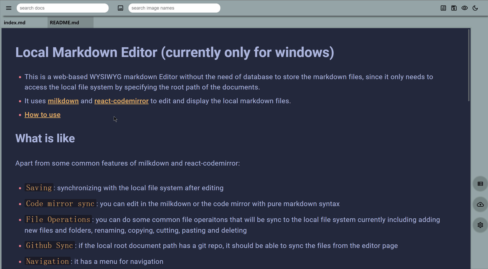

# Local Markdown Editor

- This is a web-based WYSIWYG markdown Editor delivery markdown files from your local git repo, it only needs to access the local file system by specifying the root path of the documents.

- It uses [milkdown](https://milkdown.dev/getting-started) and [react-codemirror](https://uiwjs.github.io/react-codemirror/) to edit and display the local markdown files.

- [How to use](#set-up)

## Features

Apart from some common features of milkdown and react-codemirror:

- `Saving`: synchronizing with the local file system after editing

- `Keyboard shortcuts`: shortcut for saving and read-edit mode switch

- `Code mirror sync`: you can edit and sync in the milkdown or the code mirror with pure markdown syntax

- `Sync position`: you can sync the position at the code mirror by double clicking the milkdown editor

- `File Operations`: you can do some common file operaitons that will be sync to the local file system currently including adding new files and folders, renaming, copying, cutting, pasting and deleting

- `Github Sync`: if the local root document path has a git repo, it should be able to sync the files from the editor page

- `Navigation`: it has a menu for navigation

- `Decent Search`: it should be able to search the docs quickly via some defined tags and the docs content

- `Image storage`: currently using aliyun OSS as image storage, you might need to config your aliyun account




## Set up

Clone this repo

### 1. install deps

```bash
# if you don't have pnpm yet
$ npm install -g pnpm

$ pnpm install
```

### 2. configs(optional)

Add a config.json at the root path

```json
{
  "docRootPath": "the doc absolute root path",
  "ignoreDirs": [".git", "imgs"]
}
```

> or you can just set the configs at the setting

### 3. compile and bundle the code

```bash
pnpm build
```

### 4. open the document page

> Before opening the page, make sure the code is bundled.

- run the server at terminal

```bash
$ pnpm open
```

- or create a shortcut link

1. for window

> After the bundling, you can just click the run.bat to open the documents. The bat file is actually for window shortcut so that you can open from your desktop.
> you can create a desktop shortcut by linking the run.bat or run.vbs file.
> The run.vbs is to hide the command window when you click the shortchut from your desktop.

2. for mac

> make sure the project path in run.scpt file is corrent, defualt path is ~/Markdown-editor. you can change to your own clone path.
> then save the run.scpt file as application file so that you can just double click it to open the editor.

## Development

There are two main components:

- `node server`: Doc file and git operations;
- `client`: Baic web UI.

They are developed mainly using react and typescripts. Once start, the node server and client will be auto run.

```bash
pnpm dev
```

## Publish

Formal release:

```bash
pnpm release patch
pnpm release minor
pnpm release major
```

Pre-release:

```bash
pnpm release patch --alpha
pnpm release minor --beta
pnpm release major --rc
```
